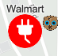

## Dictionary styles
Dictionary styles are composed of two major parts:
(1) Dictionary info
(2) Individual symbols and texts

Dictionary Info lives in the path `/resources/styles/dictionary-info.json` relatively to the dictionary url defined in the Dictionary Renderer. See comments below for detailed explanation.
```
{
    "cimRefTemplateUrl": "./resources/styles/cim/{itemName}.json", //This line tells dictionary render where to find each symbol item.
    "itemsNames": [ //used in conjunction with the url above to retrieve individual symbol and text
          "Fuel_BD",
          "Fuel_CNG",
          "Fuel_ELEC",
          "Fuel_E85",
          "Fuel_HY",
          "Fuel_LNG",
          "Fuel_LPG",
          "Con_CHADEMO",
          "Con_J1772",
          "Con_NEMA515",
          "Con_NEMA520",
          "Con_NEMA1450",
          "Con_J1772COMBO",
          "Con_TESLA",
          "Aerovironment Network",
          "Blink Network",
          "ChargePoint Network",
          "Electric Circuit",
          "FLO",
          "GE WattStation",
          "Greenlots",
          "NRG",
          "OpConnect",
          "SemaCharge Network",
          "Electric_1",
          "Tesla",
          "Volta",
          "Label",
          "eVgo Network",
          "EV Connect"
     ],
     "authoringInfo": {
          "configuration": [ //property definition of configuration used in DictionaryRenderer.config.
                  {
                      "name": "show_label",
                      "value": "true",
                      "domain": [
                            "true",
                            "false"
                      ],
                      "info": "indicates if the label should show"
                  }
            ],
      "symbol": [ //will be mapped to actual feature fields in DictionaryRenderer.fieldMap
                    "fuel_type",
                    "connector_types",
                    "network"
                ],
      "text": [   //will be mapped to actual feature fields in DictionaryRenderer.fieldMap
                  "name"
             ]
      },
      //Arcade script that defines the rules to generate symbols by Dictionary Renderer(see the parsed version in the section below)
      "expression": "\n// fuel type\nvar keys = 'Fuel_' + $feature.fuel_type;\n\n// network logo\nif (count($feature.network) > 0) {\n  keys += ';';\n  keys += $feature.network;\n  keys += ';po:network|OffsetX|-18';\n  keys += ';po:network|OffsetY|8';\n}\n\n// connectors\nif (count($feature.connector_types) > 0) {\nvar offset = 24;\n  var types = split($feature.connector_types, ' ');\n  for (var t in types) {\n    keys += ';Con_';\n    keys += types[t];\n    keys += ';po:' + types[t] + '|OffsetX|' + offset;\n    keys += ';po:' + types[t] + '|OffsetY|8';\n    offset += 18;\n  }\n}\n\n// labels\nif ($config.show_label == 'true') {\n  keys += ';Label';\n}\n\nreturn keys;"
}
```


Expression(Arcade Script)
`$feature.fuel_type` represents the value of the feature attribute of the mapped field of `fuel_type` symbol.
`;po:network|OffsetX|-18` Add primitive override to the returned symbol. Primitive override name will be network. It will override the `OffsetX` value of the symbol(or text). The overriden value is -18.
`$config.show_label` Get config infortation set on the dictionary renderer.
```
// fuel type
var keys = 'Fuel_' + $feature.fuel_type;

// network logo
if (count($feature.network) > 0) {
  keys += ';';
  keys += $feature.network;
  keys += ';po:network|OffsetX|-18';
  keys += ';po:network|OffsetY|8';
}

// connectors
if (count($feature.connector_types) > 0) {
var offset = 24;
  var types = split($feature.connector_types, ' ');
  for (var t in types) {
    keys += ';Con_';
    keys += types[t];
    keys += ';po:' + types[t] + '|OffsetX|' + offset;
    keys += ';po:' + types[t] + '|OffsetY|8';
    offset += 18;
  }
}

// labels
if ($config.show_label == 'true') {
  keys += ';Label';
}

return keys;
```


Symbol and text are [CIM symbols](https://github.com/Esri/cim-spec/blob/master/docs/v2/Overview-Symbols.md).
Text can be considered as a special type of symbol that will use the corresponding feature attribute as text string. 
```
{
  "type": "CIMPointSymbol",
  "symbolLayers": [
    {
      "type": "CIMPictureMarker",
      "enable": true,
      "anchorPointUnits": "Relative",
      "dominantSizeAxis3D": "Y",
      "size": 32,
      "billboardMode3D": "FaceNearPlane",
      "invertBackfaceTexture": true,
      "scaleX": 1,
      "textureFilter": "Picture",
      "tintColor": [
        255,
        255,
        255,
        255
      ],
      "url": "..." //url to the picture resource
    }
  ],
  "haloSize": 1,
  "scaleX": 1,
  "angleAlignment": "Display",
  "version": "2.0.0",
  "build": "8933"
}
```

Text
```
{
  "type": "CIMPointSymbol",
  "symbolLayers": [
    {
      "type": "CIMVectorMarker",
      "enable": true,
      "anchorPointUnits": "Relative",
      "dominantSizeAxis3D": "Y",
      "size": 10,
      "billboardMode3D": "FaceNearPlane",
      "frame": {
        "xmin": -5,
        "ymin": -5,
        "xmax": 5,
        "ymax": 5
      },
      "markerGraphics": [
        {
          "type": "CIMMarkerGraphic",
          "geometry": {
            "x": 0,
            "y": 0
          },
          "symbol": {
            "type": "CIMTextSymbol",
            "blockProgression": "TTB",
            "depth3D": 1,
            "extrapolateBaselines": true,
            "fontEffects": "Normal",
            "fontEncoding": "Unicode",
            "fontFamilyName": "Arial",
            "fontStyleName": "Regular",
            "fontType": "Unspecified",
            "haloSize": 1,
            "haloSymbol": {
              "type": "CIMPolygonSymbol",
              "symbolLayers": [
                {
                  "type": "CIMSolidFill",
                  "enable": true,
                  "color": [
                    255,
                    255,
                    255,
                    255
                  ]
                }
              ]
            },
            "height": 10,
            "hinting": "Default",
            "horizontalAlignment": "Center",
            "kerning": true,
            "letterWidth": 100,
            "ligatures": true,
            "lineGapType": "ExtraLeading",
            "offsetY": 18,
            "symbol": {
              "type": "CIMPolygonSymbol",
              "symbolLayers": [
                {
                  "type": "CIMSolidFill",
                  "enable": true,
                  "color": [
                    0,
                    0,
                    0,
                    255
                  ]
                }
              ]
            },
            "textCase": "Normal",
            "textDirection": "LTR",
            "verticalAlignment": "Bottom",
            "verticalGlyphOrientation": "Right",
            "wordSpacing": 100,
            "billboardMode3D": "FaceNearPlane"
          },
          "textString": "[name]"
        }
      ],
      "scaleSymbolsProportionally": true,
      "respectFrame": true
    }
  ],
  "haloSize": 1,
  "scaleX": 1,
  "angleAlignment": "Display",
  "version": "2.0.0",
  "build": "8933"
}
```


### Example:
Feature attributes:
```
const attributes = {
    ObjectID: 1,
    Fuel_Type_Code: "ELEC",
    EV_Connector_Types: "CHADEMO",
    Station_Name: "Walmart"
}
```

Dictionary Renderer defined on the feature layer:
```
const = renderer = new DictionaryRenderer({
            url: "./alternative-fuel-stations",
            fieldMap: {
              fuel_type: "Fuel_Type_Code",
              connector_types: "EV_Connector_Types",
              network: "EV_Network",
              name: "Station_Name"
            },
            config: {
              show_label: "true"
            }
          })
```

`key` returned from Arcade expression:
```
"Fuel_ELEC;Con_CHADEMO|po:CHADEMO|OffsetX|24|OffsetY|8;Label"
```

Based on the keys, the symbol will have three components: `Fuel_ELEC`, `Con_CHADEMO` and `Label`.
The corresponding styles for the components are:
* `Fuel_ELEC` : https://github.com/fangli88/fangli88.github.io/blob/master/symbolService/alternative-fuel-stations/resources/styles/cim/Fuel_ELEC.json
* `Con_CHADEMO` : https://github.com/fangli88/fangli88.github.io/blob/master/symbolService/alternative-fuel-stations/resources/styles/cim/Con_CHADEMO.json
* `Label` : https://github.com/fangli88/fangli88.github.io/blob/master/symbolService/alternative-fuel-stations/resources/styles/cim/Label.json

The final CIMSymbol will be:
```
{
  "type": "CIMSymbolReference",
  "symbol": {
    "type": "CIMPointSymbol",
    "symbolLayers": [
      {[Label]},
      {[Fuel_ELEC],
      {[Con_CHADEMO]}
    ],
    "haloSize": 1,
    "scaleX": 1,
    "angleAlignment": "Display",
    "version": "2.0.0",
    "build": "8933"
  },
  "primitiveOverrides": [
    {
      "primitiveName": "CHADEMO",
      "propertyName": "OffsetX",
      "value": 24
    },
    {
      "primitiveName": "CHADEMO",
      "propertyName": "OffsetY",
      "value": 8
    }
  ]
}
```

Result symbol when renderer on the map:



Example app using the dictionary symbology service hosted here on github: https://codepen.io/fangli88/pen/poJZbqw

**Note:** As of Pro 2.5, you can author and publish a dictionary symbol service from ArcGIS Pro using the [dictionary renderer toolkit](https://github.com/Esri/dictionary-renderer-toolkit).
